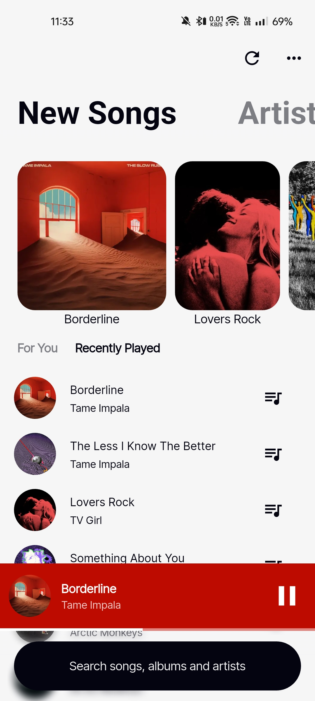
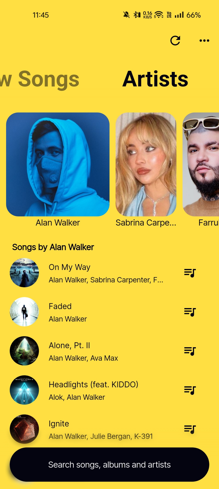
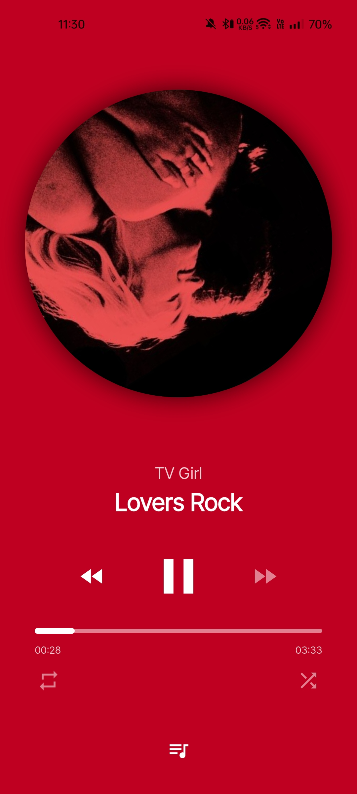
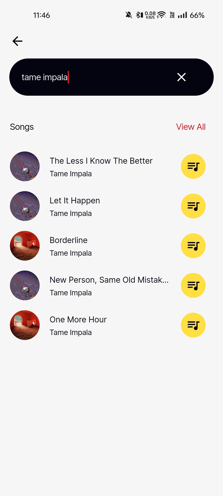
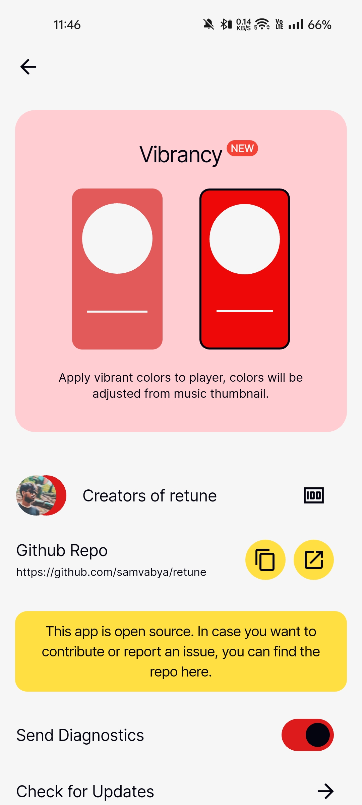
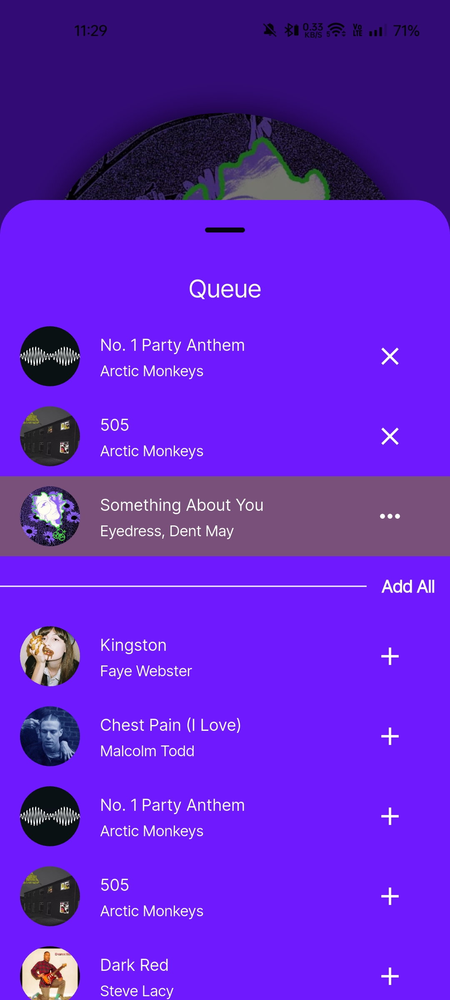

    
    <h1>retune</h1>
    
Free and open source music player.

    <!--  -->
    
    
    
    <!--  -->

---

  
  
  
  
  
  

## Features

- Play (almost) any song from Saavn API
- Background playback
- Search for songs 
- Checkout your favorite artists
- Persistent queue and brilliant suggestions
- New fresh and ambient UI design

## Installation

## Tech Stack

**Client:** Flutter, Android

**Backend:** Hive, Saavn Api
